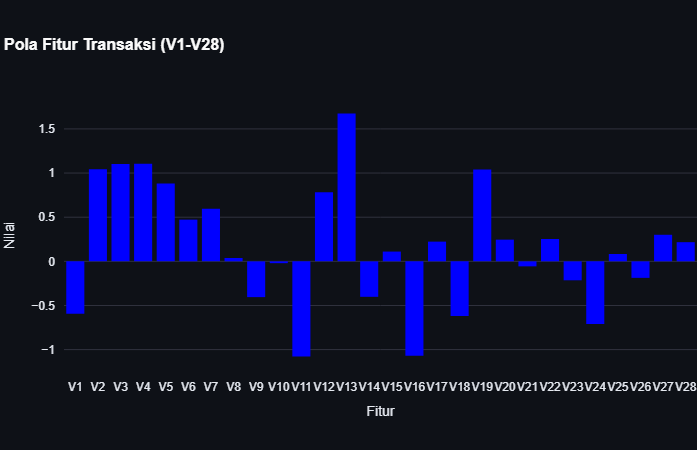
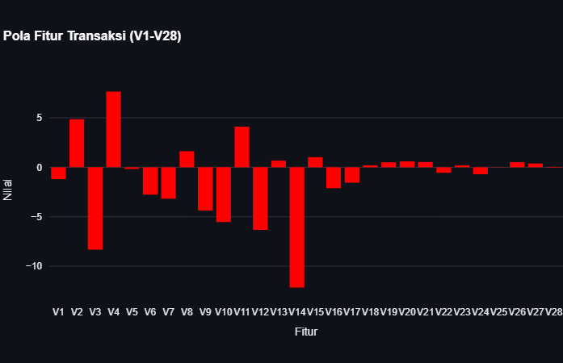

# 🛡️ SalesGuard: End-to-End E-Commerce Fraud Detection System

   

**SalesGuard** adalah sistem deteksi anomali transaksi (Fraud Detection) yang dibangun secara *Fullstack End-to-End*, sistem ini mengintegrasikan model Machine Learning untuk mendeteksi pola transaksi mencurigakan secara *real-time*.


---

## 📸 Demo Preview

| ✅ Transaksi Aman (Normal) | 🚨 Transaksi Fraud (Anomali) |
| :---: | :---: |
|  |  |
| *Grafik menunjukkan pola fitur yang stabil (rata).* | *Grafik menunjukkan lonjakan ekstrem pada fitur V14 & V3.* |

---

## 🚀 Fitur Utama

* **🧠 AI-Powered Detection:** Menggunakan algoritma **Random Forest Classifier** yang dilatih untuk mengenali pola transaksi penipuan.
* **🔌 Real-time API:** Backend berbasis **FastAPI** yang melayani request prediksi.
* **📊 Interactive Dashboard:** Frontend berbasis **Streamlit** memvisualisasikan data "Black Box" menjadi grafik yang mudah dipahami.
* **📉 Visualisasi Anomali:** Menampilkan grafik batang (Bar Chart) untuk setiap fitur transaksi guna menyoroti penyimpangan data (outliers).

---

## 📂 Data & Fitur V1-V28

Dataset yang digunakan berasal dari transaksi kartu kredit asli (Kaggle). Demi menjaga privasi nasabah, data telah melalui proses **PCA (Principal Component Analysis)**. 
Berikut penjelasannya:

### 1. Apa itu Fitur V1 - V28?
Fitur `V1`, `V2`, hingga `V28` adalah **Latent Features** (Fitur Tersembunyi) hasil transformasi matematika dari data asli (seperti Lokasi, Device, User ID, dll).
* **Sifat:** Data ini anonim dan tidak dapat dikembalikan ke bentuk asalnya (*irreversible*).
* **Fungsi:** Meskipun anonim, fitur ini mempertahankan **pola varians** dan korelasi yang diperlukan AI untuk membedakan transaksi normal vs penipuan.

### 2. Bagaimana Cara Membaca Nilainya?
Nilai pada grafik adalah representasi **Standar Deviasi (Z-Score)** dari rata-rata populasi:
* **Nilai 0:** Perilaku transaksi sama persis dengan rata-rata nasabah normal.
* **Range -2 s/d +2:** Area **zona aman (Normal)**, mencakup 95% perilaku nasabah.
* **Nilai Ekstrem (> +3 atau < -3):** Indikasi kuat adanya **Anomali/Fraud**.
    * *Contoh:* Jika `V14` bernilai `-12.0`, artinya perilaku tersebut menyimpang 12 kali lipat dari kewajaran.

---

## 🛠️ Tech Stack & Architecture

Sistem ini dibangun dengan arsitektur **Microservice Sederhana**:

1.  **Model Layer (AI):** `Scikit-Learn` & `Pandas` (Training & Serialization `.pkl`).
2.  **Backend Layer:** `FastAPI` & `Uvicorn` (Serving Model via REST API).
3.  **Frontend Layer:** `Streamlit` & `Plotly` (User Interface & Visualization).

**Struktur File:**
```bash
📂 fraud-detection-project
├── 📂 screenshots       # Folder menyimpan bukti demo
├── 📄 train_model.py    # Script untuk melatih AI & menyimpan model (.pkl)
├── 📄 main.py           # Server Backend (FastAPI)
├── 📄 dashboard.py      # Interface Frontend (Streamlit)
├── 📄 model_fraud.pkl   # File "Otak" AI yang sudah dilatih
└── 📄 requirements.txt  # Daftar library yang dibutuhkan
```

---

## ⚙️ Installation

Pastikan **Python 3.10+** sudah terinstall.

### 1. Setup Environment
```bash
# Clone repositori
git clone https://github.com/Aerial-fly/salesguard.git
cd salesguard

# Buat Virtual Environment
python -m venv venv

# Aktifkan Virtual Environment
# Windows:
venv\Scripts\activate
# Mac/Linux:
source venv/bin/activate
```

### 2. Install Dependencies
```bash
pip install -r requirements.txt
```

### 3. Setup Dataset (PENTING!) ⚠️
Karena ukuran file dataset melebihi batas GitHub, Anda perlu mengunduhnya secara manual:
1. Download dataset **Credit Card Fraud Detection** dari Kaggle: [Klik di sini](https://www.kaggle.com/datasets/mlg-ulb/creditcardfraud)
2. Ekstrak file zip tersebut.
3. Ambil file `creditcard.csv` dan letakkan di dalam folder utama proyek (sejajar dengan `main.py`).

### 4. Jalankan Aplikasi (Butuh 2 Terminal)

**Terminal 1 (Backend Server):**
```bash
# Pastikan venv aktif
uvicorn main:app --reload
# Server akan berjalan di: http://127.0.0.1:8000
```

**Terminal 2 (Frontend Dashboard):**
```bash
# Buka terminal baru, pastikan venv aktif
streamlit run dashboard.py
# Dashboard akan otomatis terbuka di browser
```

---

## 📝 Skenario Pengujian (Demo)

Untuk keperluan demonstrasi, dashboard dilengkapi dengan dua tombol simulasi:

* **🎲 Generate Random Transaction:** Mengambil data acak dari dataset (Mayoritas hasilnya Normal/Hijau).
* **⚠️ Force Fraud Transaction:** Fitur khusus demo yang memaksa sistem mengambil sampel data penipuan (`Class=1`) untuk membuktikan sensitivitas AI dalam mendeteksi pola grafik yang ekstrem (Hasil Merah).

---

## 👤 Author

**Aerial**
* GitHub: [https://github.com/Aerial-fly](https://github.com/Aerial-fly)
